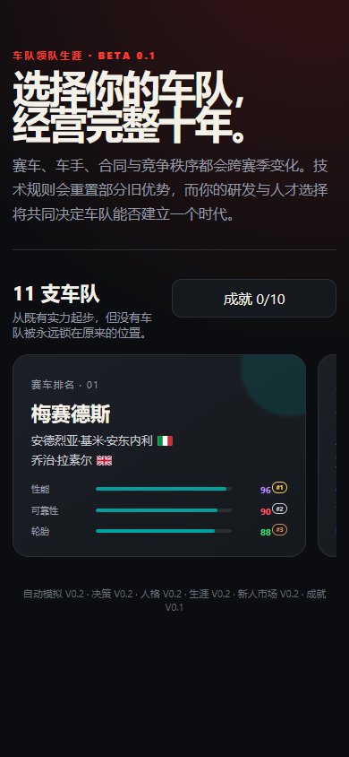
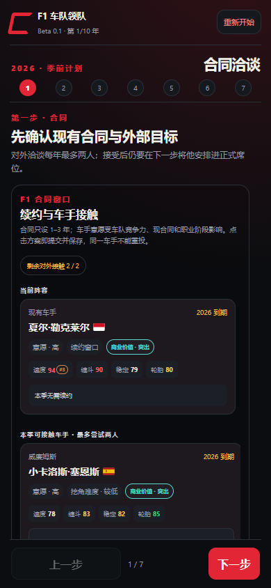
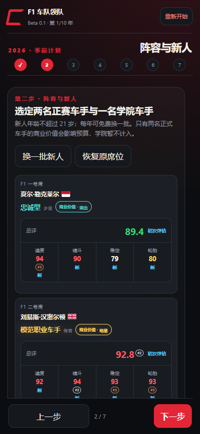
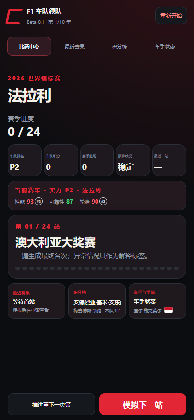
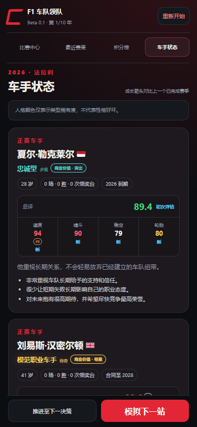

# F1 车队领队 / F1 Team Principal

一款面向手机浏览器的极简 F1 车队经营模拟游戏。玩家将管理一支车队，在 10 年职业生涯中处理车手合同、赛车研发、赛季决策和随机事件，并通过 Monte Carlo 模拟产生比赛与锦标赛结果。

> 当前版本：Beta 0.1  
> 作者：GEORGE（[@GeorgeDy7an](https://github.com/GeorgeDy7an)）

## 立即游玩

下载仓库后直接打开 [`index.html`](./index.html) 即可。游戏是单文件版本，不需要安装、不需要服务器，也不会连接后端；存档保存在浏览器的 `localStorage` 中。

## 核心内容

- 11 支车队、22 名现役车手，以及带鲜明特点的随机新人
- 车手 Pace、Racecraft、Consistency、Tyre Management 与商业价值
- 性格和隐藏类型系统、成长与衰退、合同与转会市场
- 赛车研发、引擎供应商、预算状态和赛季内调整
- Normal / Eventful / Chaos 三档比赛与稀有爆冷、退赛机制
- 10 年职业生涯、常规与隐藏成就、历史特殊事件
- 针对手机屏幕设计的分页选择和固定推进按钮

## 截图

| 车队选择 | 合同市场 |
| --- | --- |
|  |  |

| 阵容与商业价值 | 比赛中心 |
| --- | --- |
|  |  |



## 本地开发

项目不依赖第三方 npm 包，只需要 Node.js 18 或更高版本。

```bash
npm test
npm run build
```

- `src/`：九个浏览器端游戏模块
- `simulation/`：Monte Carlo 原型与校准脚本
- `scripts/build.js`：将模块重新嵌入单文件网页
- `tests/smoke.js`：语法、编码、模块同步和关键内容自检
- `index.html`：可直接分发或用于 GitHub Pages 的完整游戏

## 数据与兼容性

- 推荐使用近期版本的 Chrome、Edge、Safari 或 Firefox。
- 清除浏览器网站数据会同时清除本地存档。
- 游戏使用虚构模拟逻辑；车手评分、属性与结果不代表现实评价或预测。
- 问题与建议请通过本仓库的 GitHub Issues 提交。

## 版权与声明

本仓库代码版权归 GEORGE 所有，详见 [`LICENSE`](./LICENSE)。本项目是非官方粉丝创作，与 Formula 1、FIA、各车队、车手、赞助商及其权利人没有隶属、认可或合作关系。相关名称与商标归各自权利人所有，详见 [`NOTICE.md`](./NOTICE.md)。
